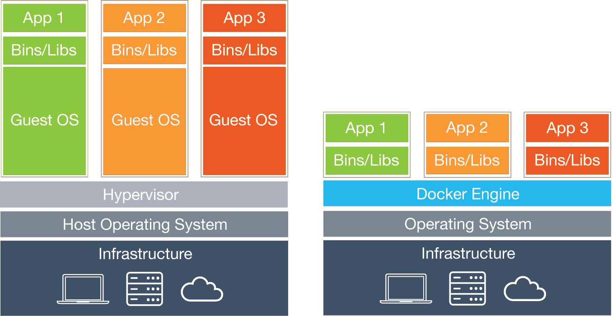
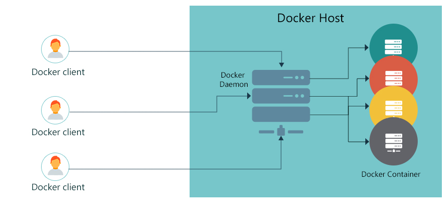

# Débuter avec Docker

https://jlafourc.github.io/docker-intro-meetup/
https://github.com/jlafourc/docker-intro-meetup/

---

Docker : What is it ? 

---

https://www.docker.com/

https://mobyproject.org/

https://www.docker.com/community-edition

https://containerd.io/

---



---

Un conteneur est environnement cloisonné dans lequel s'exécutent un ou plusieurs processus

L'environnement n'est pas virtualisé, les processus interagissent avec le noyau de l'hôte

---

### Kernel

* Namespaces : isolation des ressources système
  * filesystem
  * interfaces réseau 
  * PID
  * ...
* Cgroups : isolation des ressources physiques de la machine
  * CPU, Mémoire, Disque 

---

```bash
$ docker run --rm ubuntu ps auxf
```

---



---

```bash
$ docker run --rm ubuntu ps auxf
```

```bash
$ docker run <options> <image> <commande>
```

---


---

## Les layers

* Les layers de l'image sont en lecture seule
* Chaque layer est appliqué successivement pour reconstituer un système de fichiers
* Mutualisation possible des layers entre plusieurs images
* Création d'un nouveau layer à l'exécution du conteneur
* Mécanisme de "copy-on-write" pour la modification des fichiers existants

---

### Lister les images 


```bash
$ docker image ls
```

Farfouiller sur le hub

```bash
$ docker search ubuntu
```

---

### Récupérer une image

La dernière (latest)

```bash
$ docker pull nginx
```

Une version précise (tag)

```bash
$ docker pull nginx:1.15.0
```

Sur un autre registry que le hub (authentification possible)

```bash
$ docker login docker.depot.asso-cocktail.org
```

```bash
$ docker pull docker.depot.asso-cocktail.org/nginx:1.15.0
```

---

### Lister les conteneurs

Les conteneurs qui tournent

```bash
$ docker container ls
```

Y compris les conteneurs arrétés

```bash
$ docker container ls -a 
```

---

### Démarrer un conteneur

```bash
$ docker container run ubuntu echo "Test" 
```

```bash
$ docker run --rm ubuntu echo "Test" 
```

```bash
$ docker run --rm -ti ubuntu 
```

```bash
$ docker run --name demo ubuntu 
```

---

### Démarrer et arrêter un conteneur

```bash
$ docker run --name webserver nginx 
```

```bash
$ docker inspect webserver 
```

```bash
$ docker container start webserver 
```

```bash
$ docker container stop webserver 
```

```bash
$ docker run -d --name webserver nginx 
```

```bash
$ docker container rm webserver 
```

---

### Exécuter un nouveau process dans un conteneur existant

```bash
$ docker container exec -ti webserver bash 
```

---

### Visiualiser les logs


```bash
$ docker container logs webserver 
```

```bash
$ docker container logs -f webserver 
```

---

### Exposer les ports 


```bash
$ docker run --name webserver -p 80:80  nginx
```

```bash
$ docker run --name webserver -p 8080:80  nginx
```

```bash
$ docker run --name webserver -P nginx
```

---

### Gérer les réseaux 

```bash
$ docker network create demo
```

```bash
$ docker run -d --name webserver --network demo nginx
```

```bash
$ docker run --network demo debian curl http://webserver
```

---

### Persistence

```bash
$ docker run --rm --name demo -v /tmp:/tmp \
    ubuntu cat /tmp/test
```

```bash
$ docker run --rm --name demo -v /tmp:/files \
    ubuntu cat /files/test
```

```bash
$ docker run --rm --name demo -v /tmp:/files \
    ubuntu bash -c 'echo "Démo" > /files/demo'
```

```bash
$ docker run --rm --name demo \
    -v /var/run/docker.sock:/var/run/docker.sock \
    docker:18.03 docker ps
```

---

### Volumes

```bash
$ docker run --rm --name demo -v demo-files:/files \
    ubuntu bash -c 'echo "Démo" > /files/demo'
```

```bash
$ docker volume ls
```

```bash
$ docker volume create demo-vol
```

```bash
$ docker volume rm demo-vol
```

---

### Variables d'environnement

```bash
$ docker container run -e MA_VAR=demo --rm ubuntu env
```
---

## Exemple complet

```bash
$ docker volume create wordpress_data
```

```bash
$ docker network create wordpress
```

```bash
$ docker run -d --name wp_db --network wordpress \
    -e MYSQL_ROOT_PASSWORD=somewordpress \
    -e MYSQL_DATABASE=wordpress \
    -e MYSQL_USER=wordpress -e MYSQL_PASSWORD=wordpress \
    -v wordpress_data:/var/lib/mysql mysql:5.7 
```

```bash
$ docker run -d --name wp_app --network wordpress \
    -e WORDPRESS_DB_HOST=wp_db:3306 \
    -e WORDPRESS_DB_USER=wordpress \
    -e WORDPRESS_DB_PASSWORD=wordpress -e WORDPRESS_DB_NAME=wordpress \
    -p 8080:80 wordpress:latest 
```

---

## Pour aller plus loin

---

https://labs.play-with-docker.com/

---

## Créer ses propres images 

* A partir d'autres images
* Ajout de nos propres fichiers et scripts
* Création d'un Dockerfile
* Meetup à part entière ;)

---

## docker-compose

* Monter des stacks applicatives complètes
* Sur son poste de dev
* Définition dans un fichier docker-compose.yml

---

## Docker Swarm

* Orchestrateur de conteneurs
* Définitions de contrats de services
* Très simple à mettre en place
  * Alternative à Kubernetes 